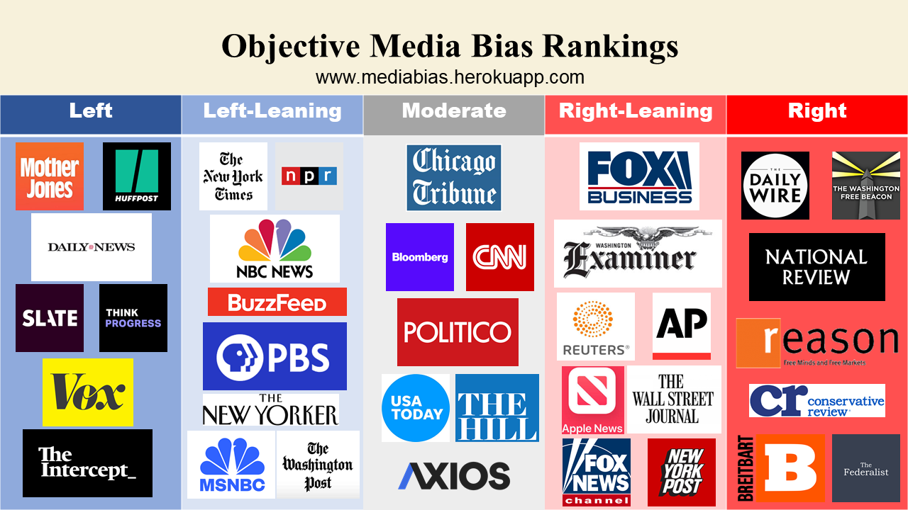

# Media bias

## Abstract

There are many claims of media bias in our discourse. With the increasing polarization of our politics, each claim of bias can in turn be claimed to be biased. Therefore, subjective claims of bias are inadequate claims of bias. No other project attempts to objectively categorize media bias. Similar projects use votes and editorial judgement to approximate an objective categorization of bias. Despite the more formal structure of these projects, they fail to clear the objectivity hurdle as any other subjective claim. This project clears this hurdle utilzing the DW-NOMINATE score and two years of congressional tweets. Therefore, this analysis provides substance to the media bias debate.

## Project goals

* Primary: Find an objective way to score bias in news organizations.
* Secondary: Estimate the political bias of a given tweet.
* Secondary: Heroku deployment.

## Method (Primary goal)

1. Gather data: tweets of congress people from  [Alex Litel's github](https://github.com/alexlitel/congresstweets). Get DW nominate scores from [Voteview](https://voteview.com/data).
2. Load data into PostgreSQL.
3. Query data for scores.
4. Use nearest neighbors to classify news organizations into Left, Left-leaning, Moderate, Right-leaning, and Right chategories.

## Method (Secondary goal ML models)

1. Use outputed data from SQL queries to assign political party to a subset of tweets in the database using pandas.
2. Select subset of tweets from Alex Litel's github to build an ML model to predict tweeters political party.
3. Remove stopwords from tweets using nltk's list.
4. Vectorize tweets using several methods from sklearn.feature_extraction.text and output models using joblib.
5. Test each method and select one to fine tune.
6. Score the final ml model.

## Results

We classified 36 news organizations into the following table.

## Run details

### How to run flask app

Within the root directory of the repository run the command `python app/app.py`.

### How to create ML models

1. Inside `mediabias/mlmodels/mediabias_main` run `git clone https://github.com/alexlitel/congresstweets`.
2. Use jupyter notebook `R_or_D.ipynb` to create the SGD Classifier and Vectorizers.
3. Use load from joblib as is done in `app/app.py` to load vectorizer, transformer, and classifier.

### Presentation

Presentation slides of the project are available in `doc/presentation`.